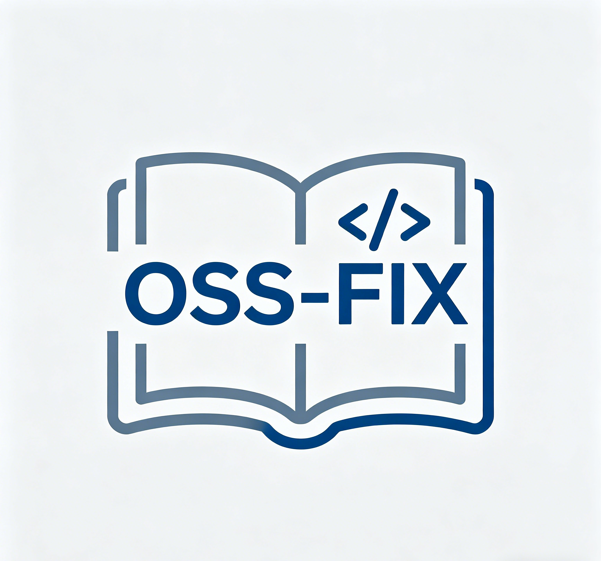
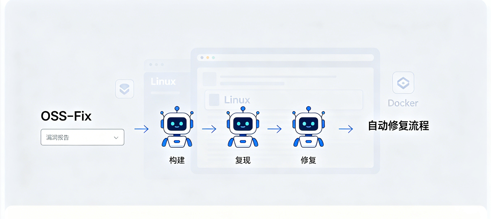

<div align="center">



# OSS-FIX

**多 Agent 自动化漏洞修复流水线** — 基于 [mini-swe-agent](https://github.com/SWE-agent/mini-swe-agent)，串联 **构建审计 → 复现 → 修复（→ 可选 Patch）**，支持本地仓库、Docker、GitHub Issue 与 **SecBench** 评测镜像。

[](https://www.python.org/)
[](https://www.docker.com/)
[](https://github.com/SWE-agent/mini-swe-agent)
[](QUICK_START.md)

[功能概览](#功能概览) · [流水线示意图](#流水线示意图) · [快速开始](#快速开始) · [文档索引](#文档索引) · [发布到 GitHub](#将仓库发布到-github)

</div>

---

## 流水线示意图

<p align="center">
  
</p>

---

## 功能概览

| 能力 | 说明 |
|------|------|
| **多阶段 Agent** | Build / Exploit / Fixer + 可选 Patch-Agent；自动校验后决定是否进入 Patch |
| **多种入口** | 本地路径、GitHub 仓库 URL、GitHub Issue、SecBench `instance_id` |
| **Docker 链式镜像** | 每阶段 `docker commit`，容器命名 `feirubei-{标签}-{时间戳}` |
| **结构化结果** | `outputs/run-*/pipeline_result.json` 汇总编译 / 复现 / 修复是否成功 |

核心编排见 `vuln_pipeline_core.py`；流水线专用 Agent 提示词在仓库根目录 `config/*.yaml`。

---

## 仓库结构（节选）

```
feirubei/
├── vuln_pipeline_core.py       # 流水线核心
├── config/                     # 流水线 Agent YAML（Build / Exploit / Fixer / Patch / vulnerability_fix）
├── run_vuln_pipeline.py        # 统一入口（路径 / 仓库 URL / Issue）
├── run_vuln_local.py           # 本地执行
├── run_vuln_docker.py          # Docker 执行
├── run_vuln_issue.py           # GitHub Issue
├── run_secbench_local.py       # SecBench 评测
├── mini-swe-agent/             # mini-swe-agent（可 pip install -e）
├── secbench_details.json       # SecBench 元数据（按需放置）
├── outputs/                    # 运行产物（默认不提交，见 .gitignore）
└── docs: QUICK_START.md, README_MULTI_AGENT.md, README_SECBENCH_EVAL.md, …
```

更细的模块说明见 [OSS-FIX_structure.md](OSS-FIX_structure.md)。

---

## 环境要求

- **Python 3.10+**（推荐 3.11 / 3.12）
- **Docker**（使用 Docker / SecBench 评测镜像时）
- 可访问 **LLM API**（OpenAI 兼容 / DeepSeek / Anthropic 等，按 `keys.cfg` 配置）

---

## 安装

```bash
git clone https://github.com/<你的用户名>/feirubei.git
cd feirubei

# 可选：使用虚拟环境
python3 -m venv .venv
source .venv/bin/activate   # Windows: .venv\Scripts\activate

# mini-swe-agent：请到上游仓库自行克隆
# 仓库：https://github.com/SWE-agent/mini-swe-agent
git clone https://github.com/SWE-agent/mini-swe-agent.git mini-swe-agent
pip install -e ./mini-swe-agent

# 或直接从 PyPI 安装（无需克隆目录）
# pip install mini-swe-agent
```
`run_mini_agent.md`简单介绍了如何使用下载安装mini-swe-agent

复制密钥模板并填写：

```bash
cp keys.cfg.example keys.cfg
```

详细说明见 [QUICK_START.md](QUICK_START.md)、[run_mini_agent.md](run_mini_agent.md)。

---

## 快速开始

### 本地仓库（宿主机）

```bash
python3 run_vuln_local.py /path/to/project
```

### Docker 中跑本地挂载的仓库

```bash
python3 run_vuln_docker.py /path/to/project
```

### GitHub Issue

```bash
python3 run_vuln_issue.py "https://github.com/owner/repo/issues/123" \
  --docker --base-image <docker image>
```

### SecBench 单实例

```bash
python3 run_secbench_local.py \
  --instance_id mruby.cve-2022-1201 \
  --json secbench_details.json \
  --model deepseek/deepseek-reasoner \
  --timeout 1800
```

评测镜像形如：`hwiwonlee/secb.eval.x86_64.<instance_id>:patch`。

---

## 输出与结果

每次运行生成目录：`outputs/run-<标签>-<时间戳>/`，内含：

- `stage*.log`、`*.traj.json`
- **`pipeline_result.json`**：`summary.compile_success`、`reproduce_success`、`fix_verified` 等
- `fix.patch`（若可生成 git diff）
- Docker 下另有 `docker-image-chain.txt` 等

---

## 文档索引

| 文档 | 内容 |
|------|------|
| [QUICK_START.md](QUICK_START.md) | 最短上手与密钥 |
| [README_MULTI_AGENT.md](README_MULTI_AGENT.md) | 多 Agent 参数与模式说明 |
| [README_SECBENCH_EVAL.md](README_SECBENCH_EVAL.md) | SecBench 与并行示例 |
| [MULTI_AGENT_WORKFLOW.md](MULTI_AGENT_WORKFLOW.md) | 项目结构与模块职责 |
| [run_mini_agent.md](run_mini_agent.md) | mini 与 API 配置 |

---


## 致谢与第三方许可证

本仓库流水线会用到下列上游组件；**再分发或发布衍生作品时，除本项目许可证外，还须分别遵守各组件许可证**（MIT 需保留版权声明与许可全文；Apache-2.0 需保留 NOTICE、版权声明及许可说明等，细则以官方文本为准）。

| 组件 | 说明 | 许可证 |
|------|------|--------|
| [mini-swe-agent](https://github.com/SWE-agent/mini-swe-agent) | 提供 `mini` CLI 与 Agent 运行框架 | **MIT**（见上游 [LICENSE](https://github.com/SWE-agent/mini-swe-agent/blob/main/LICENSE)） |
| [Patch-Agent](https://github.com/cla7aye15I4nd/PatchAgent) | 本仓库 Stage4 所用 **Patch-Agent** 能力与相关约定 | **Apache License 2.0**（见上游 [LICENSE](https://github.com/cla7aye15I4nd/PatchAgent/blob/main/LICENSE)） |

其它：

- [SWE-agent](https://github.com/SWE-agent/SWE-agent)（完整 SWE-agent 生态，常与 Patch-Agent / 修复流程对照）— 上游多为 **Apache-2.0**。
- SecBench 评测镜像与数据集（见各官方文档与 `secbench_details.json` 来源说明）。

---

## 许可证（本项目）

**本仓库自有代码**（如 `vuln_pipeline_core.py`、`config/*.yaml`、脚本与文档等）以 **Apache License 2.0** 发布，全文见仓库根目录 **`LICENSE`**；若存在 **`NOTICE`**，再分发时请一并保留。

**注意：** 上述表格中的 **mini-swe-agent（MIT）** 与 **Patch-Agent（Apache-2.0）** 等为第三方组件，其权利与义务不因本项目采用 Apache-2.0 而改变；分发时须继续遵守各上游许可证（例如保留 MIT 的版权与许可声明、Apache-2.0 要求的 `NOTICE` 与归属说明等）。
